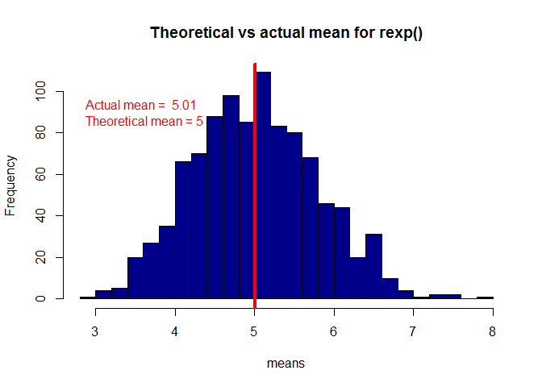
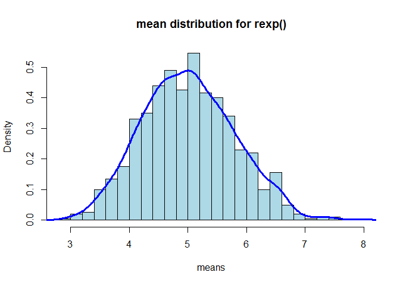

# The Central Limit Theorem Applied to the Exponential Distribution in R
Calin Uioreanu  
September 24, 2015  

# Overview
This is the course project for the statistical inference class from Coursera <https://class.coursera.org/statinference-032> 
It investigates The Exponential Distribution in R and aplies The Central Limit Theorem to a thousand mean simulations.

The project investigates the exponential distribution in R and compares it with the Central Limit Theorem. The project illustrates via simulation and associated explanatory text the properties of the distribution of the mean of 40 exponentials by the means of:

1. A simulation exercise.
2. Basic inferential data analysis.

# Simulation exercise

```r
set.seed(2015)
lambda <- 0.2 # the rate parameter lambda as instructed
n <- 40 # number of exponentials
sim <- 1000 # a thousand simulations

# the exponential distribution
plot(rexp(10000,lambda), pch=20, cex=0.6, main="The exponential distribution with rate 0.2 and 10.000 observations")
```

 

```r
# generate the collection of means for 1000 simulations of the exponential distribution
means <- NULL
for (i in 1 : sim) means <- c(means, mean(rexp(n,lambda)))
hist(means, col="blue", main="rexp mean distribution", breaks=40)
rug(means)
```

 

# Sample Mean versus Theoretical Mean
The mean of the exponential distribution is in theory 1/lambda. Since lambda is 0.2, the theoretical mean should render 5. Let's see if the numbers match:

```r
hist(means, col="darkblue", main="Theoretical vs actual mean for rexp()", breaks=20)
abline(v=mean(means), lwd="4", col="red")
text(3.6, 90, paste("Actual mean = ", round(mean(means),2), "\n Theoretical mean = 5" ), col="red")
```

 

# Sample Variance versus Theoretical Variance
The standard deviation of the exponential distribution is (1/lambda)/sqrt(n). Let's see if the numbers match:

```r
# theoretical standard deviation vs practical standard deviation
print (paste("Theoretical standard deviation: ", round( (1/lambda)/sqrt(n) ,4), ", Practical standard deviation", round(sd(means) ,4) ) )
```

```
## [1] "Theoretical standard deviation:  0.7906 , Practical standard deviation 0.7847"
```

```r
# the variance should be:
print (paste("Theoretical variance: ", (1/lambda)^2/n, ", Practical variance", round(var(means) ,4) ) )
```

```
## [1] "Theoretical variance:  0.625 , Practical variance 0.6158"
```
Therefore the numbers match.


# Is the distribution of means normal?
And lastly, let's investigate if the exponential distribution is approximately normal. Due to the Central Limit Theorem, the averages of samples should follow a normal distribution. 

```r
hist(means, prob=TRUE, col="lightblue", main="mean distribution for rexp()", breaks=20)
lines(density(means), lwd=3, col="blue")
```

 

As shown in the graph, the calculated distribution of means of random sampled exponantial distributions overlaps with the normal distribution, due to the **Central Limit Theorem**. The more samples we would get (now 1000), the closer will the density distribution be to the normal distribution bell curve.
