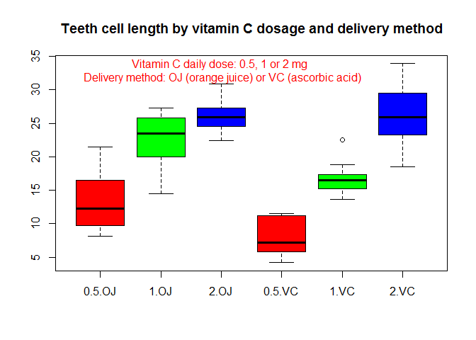

# Effect of Vitamin C on Tooth Growth in Guinea Pigs - R Analysis
Calin Uioreanu  
September 25, 2015  

# Overview
We're going to analyze the ToothGrowth data in the R datasets package. 
The ToothGrowth dataset presents the length of odontoblasts (cells responsible for tooth growth) in 60 guinea pigs. Each animal received one of three dose levels of vitamin C (0.5, 1, and 2 mg/day) by one of two delivery methods, (orange juice or ascorbic acid (a form of vitamin C and coded as VC).

# Load the ToothGrowth data and perform some basic exploratory data analyses 

```r
data(ToothGrowth, package="datasets")
dim(ToothGrowth)
```

```
## [1] 60  3
```

```r
# browse variables in the set
str(ToothGrowth)
```

```
## 'data.frame':	60 obs. of  3 variables:
##  $ len : num  4.2 11.5 7.3 5.8 6.4 10 11.2 11.2 5.2 7 ...
##  $ supp: Factor w/ 2 levels "OJ","VC": 2 2 2 2 2 2 2 2 2 2 ...
##  $ dose: num  0.5 0.5 0.5 0.5 0.5 0.5 0.5 0.5 0.5 0.5 ...
```

```r
# dose is actually a categorical variable
ToothGrowth$dose <- as.factor(ToothGrowth$dose)
```

# Provide a basic summary of the data.

```r
# summary
summary(ToothGrowth)
```

```
##       len        supp     dose   
##  Min.   : 4.20   OJ:30   0.5:20  
##  1st Qu.:13.07   VC:30   1  :20  
##  Median :19.25           2  :20  
##  Mean   :18.81                   
##  3rd Qu.:25.27                   
##  Max.   :33.90
```

```r
# graphical summary
boxplot(len ~ dose + supp, data=ToothGrowth, col=rainbow(3), plot    = TRUE, main="Teeth cell length by vitamin C dosage and delivery method")
text(3,33, "Vitamin C daily dose: 0.5, 1 or 2 mg \n Delivery method: OJ (orange juice) or VC (ascorbic acid)", col="red")
```

 

We can see that as the daily dosage of Vitamin C goes up, the size of the odontoblasts cells grows, mostly when the delivery method uses ascorbic acid instead of orange juice.


# Confidence intervals and/or hypothesis testing
We plan to reject the null hypothesis on 
We make two competing claims:

1. **The null hypothesis** that "there is nothing going on", the tooth cellular growth has nothing to do with the daily dose of Vitamin C and the delivery method and the difference observed is due to chance alone.
2. **The alternative hypothesis** that claims that tooth growth is dependent on dosage and delivery method, and the observed difference is not due to chance.


```r
#The confidence interval contains 0 so we can reject the null hypothesis. But the p-value is greater than 5% (6%) so it's not conclusive.
t.test(len ~ supp, data = ToothGrowth)
```

```
## 
## 	Welch Two Sample t-test
## 
## data:  len by supp
## t = 1.9153, df = 55.309, p-value = 0.06063
## alternative hypothesis: true difference in means is not equal to 0
## 95 percent confidence interval:
##  -0.1710156  7.5710156
## sample estimates:
## mean in group OJ mean in group VC 
##         20.66333         16.96333
```

```r
# p-value 0.6%
t.test(len ~ supp, data = subset(ToothGrowth, dose=="0.5"))
```

```
## 
## 	Welch Two Sample t-test
## 
## data:  len by supp
## t = 3.1697, df = 14.969, p-value = 0.006359
## alternative hypothesis: true difference in means is not equal to 0
## 95 percent confidence interval:
##  1.719057 8.780943
## sample estimates:
## mean in group OJ mean in group VC 
##            13.23             7.98
```

```r
# p-value 0.1%
t.test(len ~ supp, data = subset(ToothGrowth, dose=="1"))
```

```
## 
## 	Welch Two Sample t-test
## 
## data:  len by supp
## t = 4.0328, df = 15.358, p-value = 0.001038
## alternative hypothesis: true difference in means is not equal to 0
## 95 percent confidence interval:
##  2.802148 9.057852
## sample estimates:
## mean in group OJ mean in group VC 
##            22.70            16.77
```

```r
# p-value 96%
t.test(len ~ supp, data = subset(ToothGrowth, dose=="2"))
```

```
## 
## 	Welch Two Sample t-test
## 
## data:  len by supp
## t = -0.046136, df = 14.04, p-value = 0.9639
## alternative hypothesis: true difference in means is not equal to 0
## 95 percent confidence interval:
##  -3.79807  3.63807
## sample estimates:
## mean in group OJ mean in group VC 
##            26.06            26.14
```


# Conclusions and the assumptions. 
We assumed that the selection of guinea pigs is random, that the guinea pigs are more or less similar as a population abd the reasearchers that took the measurements were unaware of the dosages and supplement types (blind experiment).

The results show that we can reject the null hypothesis and that Vitamin C is effective at the lowest dose (0.5 mg/day). The vitamin C is **most effective** at the intermediate dose (1 mg/day). Also, there is a significant difference in tooth cell length between the dose levels, with higher doses resulting in longer teeth.
